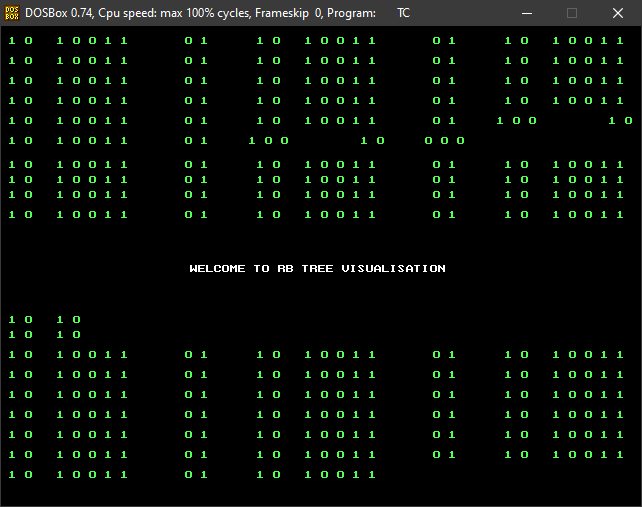
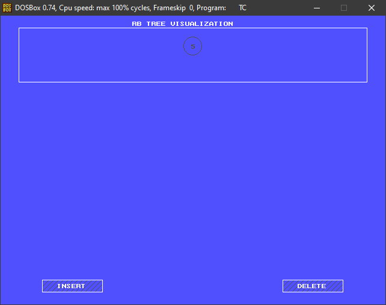
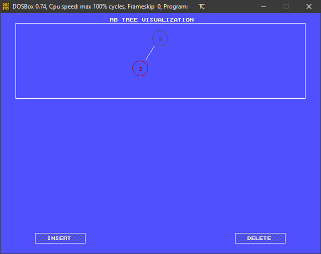

  

<h3 align="center">RB-Tree VISUALISATION</h3>

  

     
    <a href="https://github.com/BSH2409/R-B_Tree"><strong>Explore the docs »</strong></a>
     
     
    <a href="https://github.com/BSH2409/R-B_Tree">View Demo</a>
    ·
    <a href="https://github.com/BSH2409/R-B_Tree/issues">Report Bug</a>
    ·
    <a href="https://github.com/BSH2409/R-B_Tree/issues">Request Feature</a>
  

## Problem Statement

 

The following project is based on understanding the intermediate steps included in operations like insertion, searching, deletion.As many students find it difficult to implement the operations on RB-tree, this project will help them go through each step, rotation, color change, etc visually and hence, further increase their understanding.

### Built With
* [C++](https://isocpp.org/)
* [Computer Graphics(graphics.h)](https://developerinsider.co/graphics-graphics-h-c-programming/#:~:text=The%20graphics.,using%20initgraph%20method%20of%20graphics.)

### Test Bed
* CodeBlock 17.12

(<a href="#top">↑</a>)

## Getting Started
This is an example of how you may give instructions on setting up your project locally.
To get a local copy up and running follow these simple example steps.

### Prerequisites
In order to compile the following project in any IDE the basic requirement is a gcc 32 bit compiler and graphics.h library.
For smooth installation of the same refer to the given [link](https://www.youtube.com/watch?v=VEkAj-xVTKQ&t=361s)

Voilà, All Set.

(<a href="#top">↑</a>)

## Methodology
A red-black tree is a kind of self-balancing binary search tree where each node has an extra bit, and that bit is often interpreted as the color (red or black). These colors are used to ensure that the tree remains balanced during insertions and deletions. Although the balance of the tree is not perfect, it is good enough to reduce the searching time and maintain it around O(log n) time, where n is the total number of elements in the tree. This tree was invented in 1972 by Rudolf Bayer.
Rules That Every Red-Black Tree Follows: 
1.	Every node has a color either red or black.
2.	The root of the tree is always black.
3.	There are no two adjacent red nodes (A red node cannot have a red parent or red child).
4.	Every path from a node (including root) to any of its descendants’ NULL nodes has the same number of black nodes.
The time complexity for Operations on RB-Tree
  

We have used graphics.h header file to implement the visualization of the following RB-Tree Operations. To successfully run the program, one must include the graphics.h  and necessary linkers or use turboc3 compiler to run the following code and provide the path of the BGI folder to the initgraph() function. 
All the transitions have been made using the mathematical functions present in the complex.h and the math.h library.

## Additional Features
•	An attractive entry screen (matrix animation) has been created using the Fisher-Yates shuffle algorithm.

•	The Whole program is responsive to the arrow keys for navigation to make it more user-friendly and maintain a smooth run of the program.

•	The display box resizes itself according to the size of the tree so that a clean representation is obtained.

(<a href="#top">↑</a>)

## Result and Visualisation of the project through Video

https://user-images.githubusercontent.com/79904688/149501182-ef1d50e8-13f7-4675-976a-55acc0bf54e9.mp4

(<a href="#top">↑</a>)

## Contact

Bhartik Harchand - [Instagram](https://www.instagram.com/_._bsh_._/) - bsh.bhartik@gmail.com

Project Link: [https://github.com/BSH2409/R-B_Tree](https://github.com/BSH2409/R-B_Tree)

